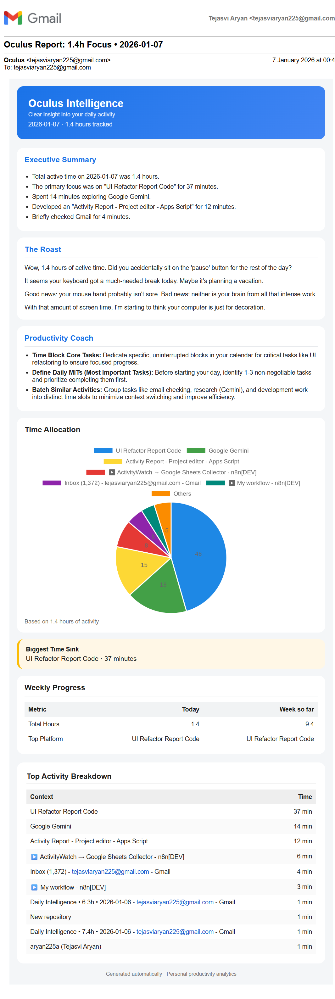
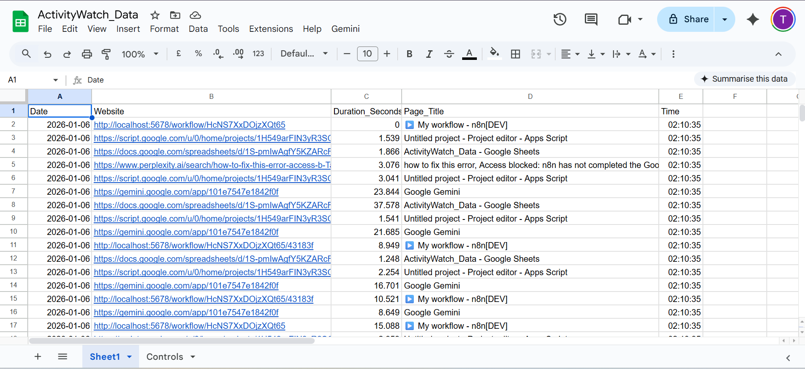
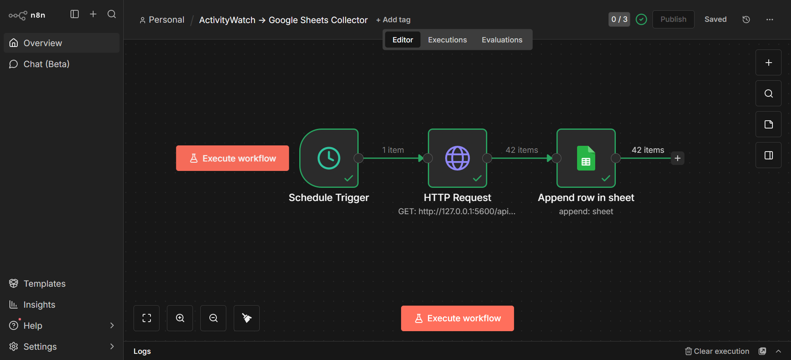

# 👁️ Oculus


**Local Activity Tracking → Smart Productivity Reports**

**Oculus** is a **privacy-first, open-source productivity system** that tracks your browsing activity locally, stores it in Google Sheets, and sends you a personalized daily email report with AI-generated insights and analysis.

All data stays under your control:
- Activity tracking runs **locally** on your machine
- Automation runs on **your machine** via n8n
- Reports are generated inside **your Google account**

**No external dashboards. No data selling. No cloud surveillance.**

---

## 👤 Who Is This For?

- Developers who want personal productivity insights
- Privacy-conscious users
- People who prefer email over dashboards
- Anyone already using ActivityWatch

---

## ✨ What This Project Does

- **Tracks browsing activity locally** using ActivityWatch
- **Automates hourly data collection** using n8n
- **Stores activity logs** in Google Sheets
- **Generates personalized reports** using Google Apps Script + Gemini AI
- **Includes three analysis perspectives**:
  - 📊 **Executive Assistant**: Concise data-driven summary with time allocation
  - 😄 **Funny Friend**: Witty, sarcastic observations about your browsing habits
  - 🎯 **Productivity Coach**: "Deep Work" vs "Distraction" analysis + actionable tips

---

## 🏗️ System Architecture

```
┌─────────────────────────────────────────────────────┐
│           Your Local Machine                        │
├─────────────────────────────────────────────────────┤
│                                                     │
│  ActivityWatch (Port 5600)                          │
│  └─ Tracks all browser activity                     │
│                                                     │
│  n8n (Port 5678)                                    │
│  └─ Hourly automation workflow                      │
│     └─ Fetches activity data                        │
│     └─ Sends to Google Sheets                       │
│                                                     │
└─────────────────────────────────────────────────────┘
              ↓ (Hourly via n8n (customizable))
┌─────────────────────────────────────────────────────┐
│           Your Google Account                       │
├─────────────────────────────────────────────────────┤
│                                                     │
│  Google Sheet                                       │
│  └─ Stores all activity logs                        │
│                                                     │
│  Google Apps Script (Daily @11:55 PM (customizable))│
│  └─ Reads today's data from Sheet                   │
│  └─ Calls Gemini API for analysis                   │
│  └─ Sends personalized email report                 │
│                                                     │
└─────────────────────────────────────────────────────┘
```

**Fault-tolerant design:**
- Laptop off → no data collected (expected)
- Laptop on → collection resumes automatically
- No duplicate or corrupted reports
- Skip days with no activity without errors

---

## 🔒 Privacy & Security

✅ **All tracking is local** — Activity data never leaves your machine until you authorize it  
✅ **No third-party analytics** — No Google Analytics, Mixpanel, or similar  
✅ **Private Google Sheet** — Only visible to you  
✅ **Secure API key storage** — Gemini API key stored in Apps Script Properties (encrypted)  
✅ **No credentials in repository** — API keys never committed to git  
✅ **Open source** — Full transparency, auditable code

**You own 100% of your data.**

---

## 📁 Repository Structure

```
oculus/
├── n8n/
│   └── activitywatch_collector.json    # n8n workflow for data collection
│
├── apps-script/
│   └── daily_report.gs                 # Google Apps Script for email reports
│
├── screenshots/
│   ├── email_report.png                # Sample email output
│   ├── sheet_data.png                  # Google Sheet with activity logs
│   └── n8n_workflow.png                # n8n automation setup
│
├── setup.md                            # Complete setup guide (step-by-step)
├── README.md                           # This file
└── .gitignore                          # Prevents accidental secret commits
```

---

## 🎯 Key Features

| Feature | Details |
|---------|---------|
| **Multi-persona Analysis** | Executive, Coach, and Friend perspectives on your productivity |
| **Real-time Tracking** | Continuous monitoring via ActivityWatch, hourly sync via n8n |
| **Email Reports** | Daily summaries with insights and recommendations |
| **Time Tracking** | Detailed breakdown by site and duration |
| **Pattern Detection** | Identifies deep work vs distraction patterns |
| **No Server Costs** | Everything runs locally or on free Google services |
| **Customizable** | Modify prompts, email templates, and triggers to suit your workflow |

---

## 🚀 Quick Start

1. **Read the [Setup Guide](./setup.md)** for complete step-by-step instructions
2. Install ActivityWatch, n8n, and configure Google Apps Script
3. Set up your Gemini API key
4. Create a daily trigger at your preferred time
5. Start tracking — your first report arrives tomorrow!

**Estimated setup time: 30-45 minutes**

---

## 📋 Requirements

- **ActivityWatch** — Free, open-source activity tracker
- **n8n** — Free, self-hosted automation platform
- **Google Account** — For Sheets and Apps Script
- **Gemini API Key** — Free tier available at [ai.google.dev](https://ai.google.dev)
- **Local machine running 24/7 (optional)** — For continuous tracking

---

## 📸 Screenshots

Screenshots are anonymized and represent a real run of the system.

### Daily Email Report
Personalized AI-generated productivity report delivered to your inbox.


### Activity Data in Google Sheets
Hourly activity logs collected locally and stored securely in your sheet.


### n8n Automation Workflow
Local automation that collects ActivityWatch data every hour.


---

## 🐛 Troubleshooting

| Issue | Solution |
|-------|----------|
| No data in Google Sheet | Verify ActivityWatch is running, n8n workflow is active |
| Email not received | Check Apps Script execution logs, verify Gmail permissions |
| "API key not set" error | Run `setGeminiApiKey()` in Apps Script editor |
| n8n workflow fails | Check ActivityWatch bucket name, timezone settings |
| Emoji rendering issues in email | Minor visual glitch, doesn't affect functionality |

See [setup.md](./setup.md) for detailed troubleshooting.

---

## 🔧 Customization

- **Modify analysis prompts** in `daily_report.gs` (line ~65)
- **Change email format** by editing the HTML template (line ~140)
- **Adjust trigger time** in Apps Script Triggers menu
- **Filter specific sites** by editing the n8n workflow
- **Change email recipient** in the `GmailApp.sendEmail()` call

---

## 🔐 Data & Privacy Model

- No data leaves your machine without your consent
- ActivityWatch runs locally
- n8n runs locally
- Google Sheet belongs to you
- Gemini API key stored securely in Apps Script Properties
- No telemetry, tracking, or analytics

This project cannot see your data. Only you can.

---

## 📜 License

MIT License — Free to use, modify, and share.

---

## 🙌 Built With

- [ActivityWatch](https://activitywatch.net/) — Open-source activity tracking
- [n8n](https://n8n.io/) — Open-source workflow automation
- [Google Apps Script](https://script.google.com/) — Cloud automation
- [Google Sheets](https://sheets.google.com/) — Data storage
- [Gemini API](https://ai.google.dev/) — AI-powered analysis
- [QuickChart](https://quickchart.io/) — Chart generation

---

## 💡 Tips

- Run n8n 24/7 for continuous tracking (use auto-startup scripts)
- Review your reports to identify productivity patterns
- Adjust your daily workflow based on coaching tips
- Keep your Gemini API key secure — treat it like a password
- Regularly clean up old data in Google Sheets (optional)

---

## 🤝 Contributing

Found a bug? Have an improvement idea?

1. Fork the repository
2. Create a feature branch
3. Submit a pull request

All contributions welcome!

---

**Questions?** Check [setup.md](./setup.md) for detailed instructions and troubleshooting.

**Ready to start?** Head to [setup.md](./setup.md) now!